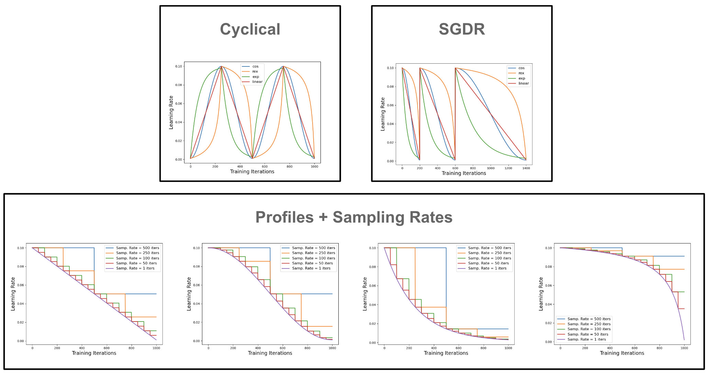

# The Best Learning Rate Schedules

[](https://cameronrwolfe.substack.com/p/the-best-learning-rate-schedules)
&nbsp;



This is a basic code respository to support an overview that I wrote in my 
Deep (Learning) Focus newsletter regarding
common learning rate schedules that are used for training neural networks.
This code can be used to reproduce:
1. Triangular/Cyclical Learning Rates
2. Learning Rate Decay with Restarts
3. Learning Rate Schedules based on Profiles and Sampling Rates

## Environment/Dependencies

Requires anaconda to be installed (python3)
Anaconda can be installed at https://www.anaconda.com/products/individual

```bash
conda create -n lr-sched python=3.8 anaconda
conda activate lr-sched
pip install -r requirements.txt
```

## File Arrangement

Here we summarize all files present in this repo and their purpose.
```
+-- figs/ : figures of different learning rate schedules saved here
+-- profiles.py : implements different growth/decay profiles
+-- sampling_rate_examples.py : generates learning rate schedules using profile + sampling rate
+-- cyclical_examples.py : generates cyclically learning rate schedules with different profiles
+-- sgdr_samples.py : generates learning rate schedules for SGD with restarts (SGDR)
+-- update_hparams.py : functions for updating LR/momentum in PyTorch optimizers
```
